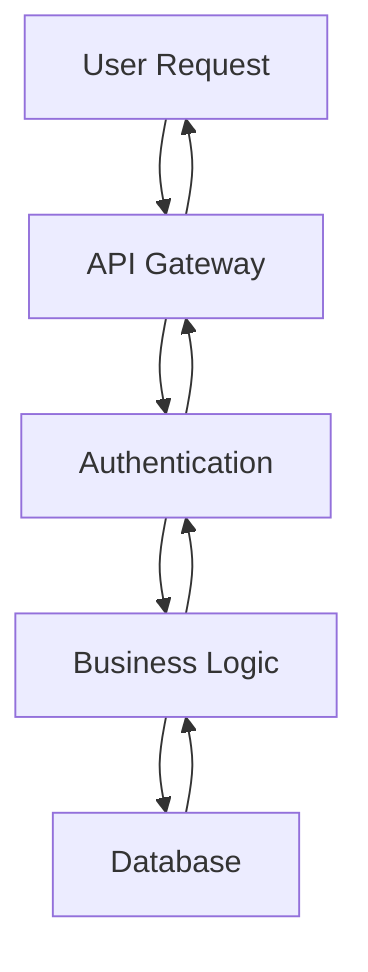

# Blog Post Structure and Guidelines

This document outlines the structure, formatting, and requirements for blog posts in Toppy's Digital Playground.

## 📝 Blog Post Structure

### File Organization

Blog posts are organized using Astro's file-based routing system:

```
src/pages/blog/
├── index.astro              # Blog listing page
├── posts/                   # Individual blog posts
│   ├── post-1.md           # Blog post files
│   ├── post-2.md
│   └── ...
└── [slug].astro            # Dynamic blog post template
```

### File Naming Convention

- **Format**: `kebab-case.md` (e.g., `aws-authentication.md`)
- **Descriptive**: Use descriptive names that reflect the content
- **SEO-friendly**: Include relevant keywords in the filename
- **Consistent**: Follow the established pattern for consistency

## 📋 Frontmatter Requirements

### Required Fields

Every blog post must include these frontmatter fields:

```yaml
---
title: "Your Post Title"           # Required: SEO-friendly title
date: "2024-01-01"                # Required: Publication date (ISO format)
description: "Brief description"  # Required: Meta description for SEO
---
```

### Optional Fields

Additional fields for enhanced functionality:

```yaml
---
title: "Your Post Title"
date: "2024-01-01"
description: "Brief description"
published: true                   # Optional: Control post visibility (default: true)
tags: ["tag1", "tag2"]           # Optional: Post categorization
author: "Theeruttop (Toppy)"     # Optional: Author name (default: from layout)
image: "/path/to/image.jpg"      # Optional: Featured image
---
```

### Frontmatter Examples

#### Basic Post
```yaml
---
title: "Getting Started with Astro"
date: "2024-01-15"
description: "Learn how to build modern static sites with Astro framework"
---
```

#### Advanced Post
```yaml
---
title: "Building Scalable APIs with Node.js"
date: "2024-01-20"
description: "Best practices for creating robust and scalable Node.js APIs"
published: true
tags: ["nodejs", "api", "backend", "scalability"]
author: "Theeruttop (Toppy)"
image: "/images/nodejs-api-guide.jpg"
---
```

## ✍️ Content Guidelines

### Writing Style

- **Tone**: Professional yet approachable
- **Voice**: First-person perspective when sharing personal experiences
- **Clarity**: Clear, concise explanations
- **Examples**: Include practical code examples and use cases

### Content Structure

#### Recommended Post Structure

1. **Introduction** (1-2 paragraphs)
   - Hook the reader
   - Explain what they'll learn
   - Set expectations

2. **Main Content** (3-8 sections)
   - Logical flow of information
   - Clear headings and subheadings
   - Code examples with explanations

3. **Conclusion** (1 paragraph)
   - Summarize key points
   - Call to action
   - Related resources

#### Example Structure

```markdown
# Getting Started with Astro

## Introduction
Brief introduction to the topic...

## Prerequisites
What readers need to know before starting...

## Step-by-Step Guide
### Step 1: Installation
### Step 2: Configuration
### Step 3: Development

## Best Practices
Key recommendations and tips...

## Conclusion
Summary and next steps...
```

## 💻 Code Examples

### Code Block Formatting

Use proper syntax highlighting for all code blocks:

````markdown
```javascript
// JavaScript example
const greeting = "Hello, World!";
console.log(greeting);
```

```python
# Python example
def greet(name):
    return f"Hello, {name}!"

print(greet("World"))
```
````

### Supported Languages

The site supports syntax highlighting for:
- JavaScript/TypeScript
- Python
- Java
- Go
- Rust
- HTML/CSS
- SQL
- Bash/Shell
- And many more...

### Inline Code

Use backticks for inline code references:

```markdown
Use the `npm install` command to install dependencies.
```

## 📊 Diagrams and Visuals

### Mermaid Diagrams

Use Mermaid for technical diagrams:

````markdown

````

### Supported Diagram Types

- **Flowcharts**: Process flows and decision trees
- **Sequence Diagrams**: API interactions and workflows
- **Class Diagrams**: Object-oriented design
- **ER Diagrams**: Database relationships
- **Gantt Charts**: Project timelines
- **Git Graphs**: Version control workflows

### Images

- **Format**: Use WebP or optimized JPEG/PNG
- **Size**: Optimize for web (under 500KB when possible)
- **Alt Text**: Always include descriptive alt text
- **Responsive**: Images automatically scale on different devices

```markdown

```

## 🔍 SEO Optimization

### Title Guidelines

- **Length**: 50-60 characters for optimal display
- **Keywords**: Include relevant keywords naturally
- **Descriptive**: Clearly indicate the post content
- **Unique**: Each title should be unique across the site

### Description Guidelines

- **Length**: 150-160 characters for meta descriptions
- **Compelling**: Encourage clicks from search results
- **Accurate**: Reflect the actual content
- **Keywords**: Include primary keywords naturally

### Heading Structure

Use proper heading hierarchy:

```markdown
# Main Title (H1) - Only one per post
## Section Heading (H2)
### Subsection (H3)
#### Detail Level (H4)
```

## 📱 Responsive Content

### Mobile Considerations

- **Short Paragraphs**: Keep paragraphs concise for mobile reading
- **Clear Headings**: Use descriptive headings for easy scanning
- **Code Blocks**: Ensure code examples are readable on mobile
- **Images**: Use responsive images that scale properly

### Reading Experience

- **Line Length**: Optimal reading width (80 characters)
- **White Space**: Adequate spacing between sections
- **Typography**: Clear font hierarchy and sizing
- **Navigation**: Easy to navigate between sections

## 🏷️ Tagging System

### Tag Guidelines

- **Consistency**: Use consistent tag names (lowercase, hyphenated)
- **Relevance**: Tags should accurately describe the content
- **Moderation**: Don't over-tag (3-5 tags maximum)
- **Categories**: Use broad categories for organization

### Suggested Tags

- **Technologies**: `javascript`, `typescript`, `python`, `nodejs`, `react`
- **Topics**: `tutorial`, `guide`, `best-practices`, `performance`
- **Levels**: `beginner`, `intermediate`, `advanced`
- **Categories**: `frontend`, `backend`, `devops`, `tools`

## 📈 Performance Considerations

### Content Optimization

- **Images**: Optimize and compress images
- **Code**: Keep code examples focused and relevant
- **Length**: Aim for 1000-3000 words for optimal engagement
- **Structure**: Use clear headings for easy scanning

### Loading Performance

- **Lazy Loading**: Images load as needed
- **Code Highlighting**: Syntax highlighting is optimized
- **Minimal JavaScript**: Content renders without heavy JS
- **Fast Navigation**: Prefetching for smooth transitions

## 🔧 Technical Requirements

### Markdown Support

The site supports extended Markdown features:

- **Tables**: For structured data presentation
- **Task Lists**: For checklists and todo items
- **Footnotes**: For additional references
- **Math**: LaTeX math expressions (if needed)

### File Encoding

- **UTF-8**: Use UTF-8 encoding for all files
- **Line Endings**: Use LF (Unix) line endings
- **Special Characters**: Properly escape special characters

## 📝 Content Review Process

### Pre-Publication Checklist

- [ ] Frontmatter is complete and accurate
- [ ] Title and description are SEO-optimized
- [ ] Code examples are tested and working
- [ ] Images are optimized and have alt text
- [ ] Grammar and spelling are checked
- [ ] Links are working and relevant
- [ ] Content follows the established style guide

### Quality Standards

- **Accuracy**: All technical information is verified
- **Clarity**: Content is clear and easy to understand
- **Completeness**: Topics are covered thoroughly
- **Relevance**: Content is current and useful
- **Originality**: Content provides unique value

## 🚀 Publishing Workflow

### Development Process

1. **Create Post**: Add new `.md` file in `src/pages/blog/posts/`
2. **Write Content**: Follow content guidelines and structure
3. **Test Locally**: Use `pnpm dev` to preview the post
4. **Review**: Check formatting, links, and code examples
5. **Commit**: Use conventional commit messages
6. **Deploy**: Push to main branch for automatic deployment

### Version Control

- **Branch**: Create feature branch for new posts
- **Commits**: Use descriptive commit messages
- **Pull Request**: Submit PR for review (if collaborating)
- **Merge**: Merge to main branch for publication

---

Following these guidelines ensures consistent, high-quality blog posts that provide value to readers while maintaining the site's performance and SEO optimization.
