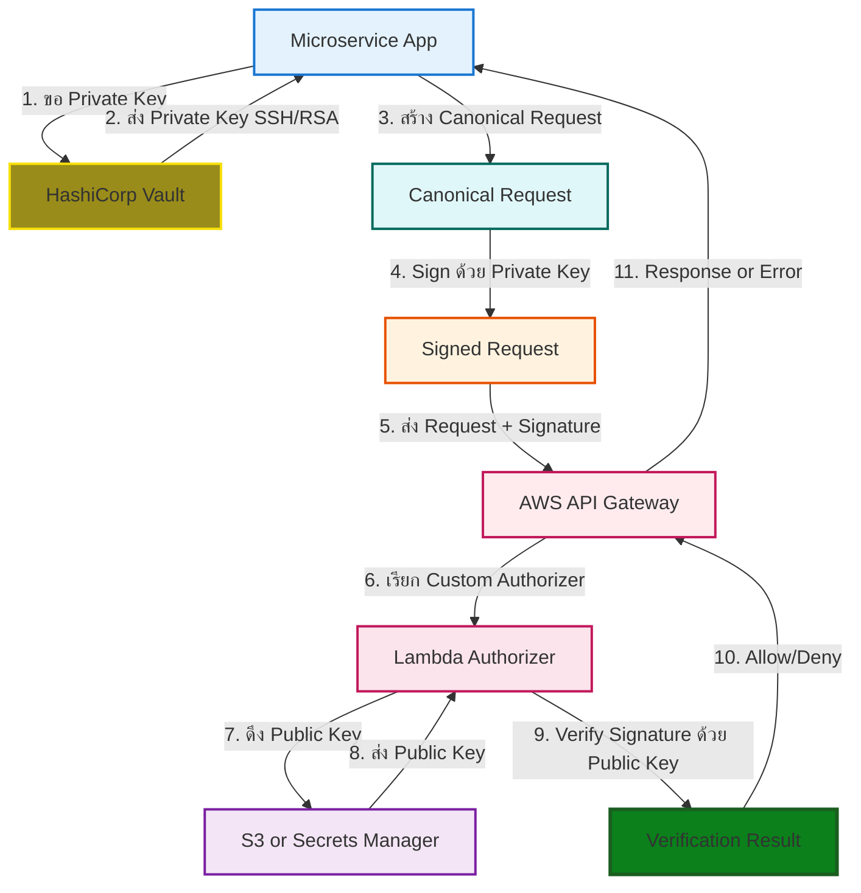

# ระบบ Authentication กับ AWS: Custom Digital Signature

## ทำไมต้องใช้ SSH Key Pairs (Asymmetric Key) กับ AWS? 🤔

ในการพัฒนา **Microservices** ที่ต้องเชื่อมต่อกับ AWS services การใช้ Credentials แบบเดิมๆ (**Symmetric Key** เช่น Access Key/Secret Key) มีข้อจำกัดร้ายแรงในด้านการพิสูจน์ตัวตน:

- **เสี่ยงต่อการรั่วไหล:** Secret Key ต้องถูกแชร์ทั้งฝั่ง Microservice และ AWS ซึ่งเพิ่มจุดอ่อนในการรั่วไหล
- **ขาดการพิสูจน์ตัวตนที่แข็งแกร่ง:** แม้แต่ AWS SigV4 ก็ยังคงเป็น Symmetric Key ซึ่งไม่สามารถยืนยันความเป็นเจ้าของ Private Key ได้
- **ความยืดหยุ่น:** Custom Asymmetric Authentication นี้ช่วยให้เรากำหนดและควบคุมกลไกการตรวจสอบได้เองผ่าน **API Gateway**

ระบบนี้จึงใช้ **Asymmetric Key (SSH/RSA)** โดย **Microservice** ใช้ **Private Key** ในการ **เซ็นลายเซ็นดิจิทัล** และ **AWS API Gateway (ผ่าน Lambda)** ใช้ **Public Key** ในการ **ตรวจสอบ**

## 🔄 Flow การทำงานแบบละเอียด (Custom Asymmetric Authentication)

ระบบนี้ใช้ **Custom Asymmetric Cryptography** โดย **Microservice (MS)** ใช้ **Private Key (SSH/RSA)** ในการ **เซ็น (Sign)** Request และ **AWS API Gateway** ใช้ **Public Key** ในการ **ตรวจสอบ (Verify)** ลายเซ็น (ผ่าน Custom Authorizer Lambda)



## 📝 Flow การทำงาน (อธิบายตาม Custom Flow)

### Phase 1: Key Acquisition

**Microservice** ใช้ Service Account Token เพื่อยืนยันตัวตนกับ **Vault** และดึง **Private Key (SSH/RSA)** ที่เข้ารหัสมาใช้งาน

### Phase 2: Request Signing

**Microservice เตรียม Request:**

- เตรียมข้อมูลที่จะส่ง และจัดให้อยู่ในรูปแบบ **Canonical Request**
- **เซ็น (Sign)** Request ด้วย **Private Key** ที่ได้มาจาก Vault
- แนบ **Digital Signature** ไปกับ Request (เช่น ใน Header `X-Signature`)

### Phase 3: AWS Verification

**AWS ตรวจสอบ Request:**

- **API Gateway** รับ Request และส่งต่อไปยัง **Custom Authorizer Lambda**
- **Lambda** ดึง **Public Key** ที่ใช้คู่กันจากแหล่งจัดเก็บที่ปลอดภัย (เช่น S3 หรือ Secrets Manager)
- **Lambda** ใช้ Public Key เพื่อ **ตรวจสอบ (Verify)** ลายเซ็นดิจิทัลกับ Request Data เดิม
- หากลายเซ็นถูกต้อง Lambda จะส่ง Policy เป็น **Allow** กลับไปยัง API Gateway เพื่อให้ Request ดำเนินการต่อไปยัง Service ปลายทาง

## 🔑 การทำงานของระบบ Authentication

ระบบนี้สร้าง **Chain of Trust** โดยใช้ Private Key เป็นหลักฐานในการพิสูจน์ตัวตนของ Microservice

## 🛠 การ Implement แต่ละขั้นตอน

### 1. การสร้างและจัดการ Key Pairs

**ทำไมต้องแยก Key Pairs ต่อ Service?**

การแยก Key Pairs สำหรับแต่ละ Microservice ช่วยให้สามารถกำหนด **Principle of Least Privilege (POLP)** ได้อย่างแม่นยำ และช่วยจำกัดความเสียหาย (**Blast Radius**) หาก Key ใด Key หนึ่งรั่วไหล

- **มาตรฐาน:** ควรใช้ RSA Key Length อย่างน้อย **4096-bit** เพื่อความปลอดภัย
- **การจัดเก็บ:** **Private Key** ต้องถูกจัดเก็บใน **HashiCorp Vault** เท่านั้น ส่วน **Public Key** ถูกเก็บใน **S3** หรือ **Secrets Manager** เพื่อให้ Lambda ดึงไปใช้งาน

```bash
# ===== สร้าง Key Pair สำหรับแต่ละ Service (ตัวอย่าง) =====
ssh-keygen -t rsa -b 4096 -C "payment-service@company.com" -f ~/.ssh/payment-service
ssh-keygen -t rsa -b 4096 -C "notification-service@company.com" -f ~/.ssh/notification-service
```

มีหลายจุดที่ format ไม่ถูกต้อง ให้ฉันแก้ให้:

````markdown
### 2. การจัดการ Public Keys บน AWS (สำหรับการตรวจสอบโดย Lambda)

Public Key จะถูกจัดเก็บไว้ใน S3 หรือ Secrets Manager โดยที่ Lambda Authorizer มีสิทธิ์ในการอ่านเท่านั้น

#### ขั้นตอนการเตรียม Public Key และการ Upload (Initial Setup)

ก่อนที่ Lambda Authorizer จะสามารถดึง Public Key ไปใช้งานได้ Public Key ที่สร้างขึ้นจะต้องถูกนำไปวางไว้ใน AWS Service ที่กำหนด (S3 หรือ Secrets Manager) ก่อน

**ขั้นตอน:**

1. **สร้าง Key Pair:** ใช้คำสั่ง `ssh-keygen` เพื่อสร้าง Private Key (เก็บใน Vault) และ Public Key (ไฟล์ `.pub`)
2. **Upload Public Key:** ต้องนำไฟล์ Public Key ที่เป็นไฟล์ `.pub` ไป Upload หรือ Import เข้าไปใน S3 Bucket หรือ Secrets Manager โดยอาจทำผ่านหน้า AWS Console หรือ AWS CLI

#### วิธีที่ 1: จัดเก็บ Public Key ใน S3

1. สร้างไฟล์ `.pub` (Public Key)
2. อัปโหลดไฟล์ `.pub` ไปยัง S3 Bucket ที่กำหนด (`service-public-keys/payment-service.pub`)

```bash
# Upload Public Key ไปยัง S3
aws s3 cp ~/.ssh/payment-service.pub s3://service-public-keys/payment-service.pub
```
````

#### วิธีที่ 2: จัดเก็บ Public Key ใน AWS Secrets Manager

```bash
# ===== อัปโหลด Public Key ผ่าน CLI ไปยัง Secrets Manager =====
# (Public Key จะถูกเข้ารหัสใน Secrets Manager)
aws secretsmanager create-secret \
  --name payment-service-public-key \
  --secret-string file://~/.ssh/payment-service.pub
```

#### การกำหนดสิทธิ์ (IAM Policy สำหรับ Lambda Authorizer)

Lambda ที่ทำหน้าที่ Authorizer จะต้องมีสิทธิ์ในการ **อ่าน** Public Key จากแหล่งจัดเก็บเท่านั้น และมีสิทธิ์ในการสร้าง **IAM Policy (Allow/Deny)** เพื่อคืนค่ากลับไปยัง API Gateway

```json
{
  "Version": "2012-10-17",
  "Statement": [
    {
      "Effect": "Allow",
      "Action": "s3:GetObject",
      "Resource": "arn:aws:s3:::service-public-keys/*"
    },
    {
      "Effect": "Allow",
      "Action": "secretsmanager:GetSecretValue",
      "Resource": "arn:aws:secretsmanager:*:*:secret:*"
    }
  ]
}
```

### 3. กระบวนการ Sign Request และ Verification

#### 3.1 Spring Boot MS: การดึง Private Key จาก Vault และการ Sign Request (เพื่อเรียก API Gateway)

Microservice ที่ใช้ Spring Boot จะใช้ HashiCorp Vault Client เพื่อดึง Private Key มาใช้ในการเซ็น Request ก่อนส่งไปยัง API Gateway

```java
import java.security.*;
import java.util.Base64;

// สมมติว่านี่คือ Service Layer ใน Spring Boot Application
// @Service
public class PaymentService {

    // (Conceptual) PrivateKey จะถูกโหลดมาจาก HashiCorp Vault
    // ผ่าน Spring Cloud Vault หรือ Vault Client เมื่อ application start
    private PrivateKey privateKey;

    // Constructor and Vault key loading logic
    // ในชีวิตจริง ต้องมีโค้ดที่ทำการโหลด PrivateKey จาก Vault

    public String createSignedRequest(String requestData) throws Exception {
        // ขั้นตอนที่ 1: การเซ็น (Signing)
        Signature signature = Signature.getInstance("SHA256withRSA");

        // Private Key ถูกดึงและโหลดเข้าสู่หน่วยความจำของ MS (จาก Vault)
        signature.initSign(this.privateKey);
        signature.update(requestData.getBytes("UTF-8"));

        // แปลงลายเซ็นเป็น Base64 สำหรับแนบไปกับ Header X-Signature
        String signedRequest = Base64.getEncoder().encodeToString(signature.sign());

        // ส่ง Request Data (Canonical) และ Signature ไปยัง API Gateway
        // headers.add("X-Signature", signedRequest);
        return signedRequest;
    }
}
```

#### 3.2 Lambda Authorizer: การดึง Public Key จาก S3/Secrets Manager และการ Verify (สำหรับ API Gateway)

Lambda Authorizer จะใช้ AWS SDK (เช่น S3Client หรือ SecretsManagerClient) เพื่อดึง Public Key ที่สอดคล้องกับ Microservice ที่เรียกมาใช้ในการตรวจสอบลายเซ็น โดยใช้ IAM Role ของ Lambda ในการเข้าถึง S3 หรือ Secrets Manager โดยตรง

```java
import software.amazon.awssdk.services.s3.S3Client;
import software.amazon.awssdk.services.s3.model.GetObjectRequest;
import java.io.InputStream;
import java.security.*;
import java.util.Base64;
import java.security.spec.X509EncodedKeySpec;

public class CustomAuthorizer {

    private final S3Client s3Client;

    public CustomAuthorizer() {
        // การเชื่อมต่อ S3/Secrets Manager โดยใช้ IAM Role ของ Lambda
        this.s3Client = S3Client.builder().build();
    }

    private PublicKey getPublicKeyFromS3(String keyId) throws Exception {
        // ตัวอย่างการดึง Public Key จาก S3 Bucket
        GetObjectRequest getObjectRequest = GetObjectRequest.builder()
                .bucket("service-public-keys")
                .key(keyId + ".pub") // เช่น "payment-service.pub"
                .build();

        // โหลด Public Key (ไฟล์ .pub) จาก S3
        try (InputStream is = s3Client.getObject(getObjectRequest)) {
            String keyString = new String(is.readAllBytes());

            // ลบ header/footer ของ SSH Public Key ออก
            String publicKeyPEM = keyString
                .replace("-----BEGIN PUBLIC KEY-----", "")
                .replace("-----END PUBLIC KEY-----", "")
                .replaceAll("\\s", "");
            byte[] keyBytes = Base64.getDecoder().decode(publicKeyPEM);

            // สร้าง PublicKey Object
            X509EncodedKeySpec keySpec = new X509EncodedKeySpec(keyBytes);
            KeyFactory keyFactory = KeyFactory.getInstance("RSA");
            return keyFactory.generatePublic(keySpec);
        }
    }

    public boolean verifySignature(String requestData, String base64Signature,
                                   String serviceKeyId) throws Exception {
        // 1. ดึง Public Key จาก S3/Secrets Manager
        PublicKey publicKey = getPublicKeyFromS3(serviceKeyId);
        byte[] decodedSignature = Base64.getDecoder().decode(base64Signature);

        // 2. การตรวจสอบ (Verification)
        Signature verifier = Signature.getInstance("SHA256withRSA");
        verifier.initVerify(publicKey);
        verifier.update(requestData.getBytes("UTF-8"));

        boolean isValid = verifier.verify(decodedSignature);

        // Logic to return IAM Policy based on isValid
        return isValid;
    }
}
```

#### 3.3 Spring Boot MS: การใช้ Digital Signature เข้าถึง S3 Bucket โดยตรง (เพื่ออ่าน Interface File)

สำหรับสถานการณ์นี้ Microservice จะใช้ Private Key ที่ได้มาจาก Vault เพื่อเซ็น Request ในการเรียก GetObject ของ S3 โดยตรง (เลียนแบบ SigV4 ด้วย Private Key)

**หมายเหตุ:** ในการใช้งานจริง การเซ็น Request ด้วย Asymmetric Key เพื่อเรียก AWS API โดยตรง ต้องใช้ Custom Request Signer ที่จัดการการเซ็นแบบ Asymmetric Key และการแมปกับ IAM Principal

```java
import software.amazon.awssdk.services.s3.S3Client;
import software.amazon.awssdk.services.s3.model.GetObjectRequest;
import java.security.*;
import java.util.Base64;
// import org.springframework.stereotype.Service;

// @Service
public class S3InterfaceFileProcessor {

    private final S3Client s3Client;
    private final PrivateKey signingPrivateKey; // Private Key จาก Vault

    public S3InterfaceFileProcessor(PrivateKey signingPrivateKey) {
        // Initialization
        this.s3Client = S3Client.builder().build(); // S3 Client Standard
        this.signingPrivateKey = signingPrivateKey;

        // **สำคัญ:** ในการใช้งานจริง ต้องมีการผสานรวม Custom Signer เข้ากับ S3Client
        // เพื่อให้ทุก Request ที่ออกจาก S3 Client ถูกเซ็นด้วย signingPrivateKey
    }

    public String readInterfaceFile(String bucketName, String key) throws Exception {

        // 1. สร้าง Canonical Request สำหรับ S3 GetObject
        GetObjectRequest getObjectRequest = GetObjectRequest.builder()
                .bucket(bucketName)
                .key(key)
                .build();

        // 2. (Conceptual) Custom Signer จะเข้าสู่กระบวนการเซ็น Request
        // โดยใช้ signingPrivateKey และแนบ Signature ไปกับ Header
        // ... customRequestSigner.sign(getObjectRequest, signingPrivateKey); ...

        // 3. เรียก S3 API
        try {
            // S3Client จะส่ง Request ที่มี Signature ที่เซ็นด้วย Private Key
            return s3Client.getObjectAsBytes(getObjectRequest).asUtf8String();
        } catch (Exception e) {
            // AWS จะทำการตรวจสอบลายเซ็นด้วย Public Key ที่ผูกกับ IAM Role/User
            // หากลายเซ็นถูกต้อง จะอนุญาตให้เข้าถึงไฟล์
            throw new RuntimeException("Error reading file from S3: " + e.getMessage());
        }
    }
}
```

## สรุปรูปแบบการทำ Digital Signature (Sign & Verify)

### 1. รูปแบบ: Authentication สำหรับ API Gateway (Microservice ➡️ Lambda Authorizer)

นี่คือวัตถุประสงค์หลักของเอกสารนี้ เป็นการใช้ Digital Signature เพื่อพิสูจน์ตัวตนของ Microservice ก่อนเข้าถึง API Endpoint

| หัวข้อ           | Microservice (Signer)            | AWS (Verifier)                                      |
| :--------------- | :------------------------------- | :-------------------------------------------------- |
| **วัตถุประสงค์** | ยืนยันตัวตนของ Microservice      | อนุญาต/ปฏิเสธ การเรียก API                          |
| **Key ที่ใช้**   | Private Key (จาก Vault)          | Public Key (จาก S3/Secrets Manager)                 |
| **โค้ด**         | `xxxService.java` (เซ็น Request) | `CustomAuthorizer.java` (ดึง Key จาก S3 และตรวจสอบ) |

### 2. รูปแบบ: Authorization สำหรับ S3 โดยตรง (Microservice ➡️ S3/AWS API)

ซึ่งเป็นการใช้ Private Key ในการสร้างลายเซ็นเพื่อ เข้าถึง AWS Service โดยตรง (เช่น S3, DynamoDB) ซึ่งต้องมีการปรับใช้หลักการคล้าย AWS SigV4 แต่ใช้ Asymmetric Key แทน Symmetric Key

| หัวข้อ           | Microservice (Signer)                                       | AWS (Verifier)                                  |
| :--------------- | :---------------------------------------------------------- | :---------------------------------------------- |
| **วัตถุประสงค์** | เข้าถึง Resource ใน S3/AWS                                  | ตรวจสอบสิทธิ์การเข้าถึง Resource นั้นๆ          |
| **Key ที่ใช้**   | Private Key (จาก Vault)                                     | Public Key (Public Key ที่ผูกกับ IAM Principal) |
| **โค้ด**         | `S3InterfaceFileProcessor.java` (เซ็น Request ก่อนเรียก S3) | IAM/AWS Service (ตรวจสอบลายเซ็นตาม Protocol)    |

### สรุป: 2 บทบาทของ Digital Signature ในระบบ Microservice

ดังนั้น หากมองในเชิงการประยุกต์ใช้ในระบบ Microservice ของเรา จึงมี 2 บทบาทที่แตกต่างกัน:

1. **การควบคุมการเข้าถึง (Access Control)** - ผ่าน API Gateway โดยใช้ Lambda Authorizer
2. **การเข้าถึง AWS Resource โดยตรง (Resource Access)** - ผ่าน AWS SDK ที่มี Custom Signing Logic

**หมายเหตุ:** รูปแบบที่ 2 (Authorization สำหรับ S3 โดยตรง) ต้องการการปรับแต่งเพิ่มเติมและไม่ใช่ standard AWS authentication pattern แนะนำให้ใช้รูปแบบที่ 1 ผ่าน API Gateway สำหรับความปลอดภัยและความสะดวกในการจัดการ

## 💡 Best Practices & Lessons Learned

### การจัดการ Keys

- หมุนเวียน Keys (Rotation) ทุก 90 วัน
- เก็บ Private Keys ใน Vault เท่านั้น
- Public Key ถูกเก็บแยกใน S3/Secrets Manager

### การจัดการ Permissions

- ใช้ Principle of Least Privilege อย่างเข้มงวด
- Lambda Authorizer มีสิทธิ์แค่อ่าน Public Key และสร้าง IAM Policy เท่านั้น

### Monitoring & Alerts

- Log ทุก Authentication Attempts (Success/Fail) ใน CloudWatch
- Alert เมื่อ Authorizer คืนค่า Deny ซ้ำๆ
- ทำ Audit Trail ของการเข้าถึง Keys

### Performance Optimization

**💡 Tips:** การใช้ Custom Authorizer ทำให้เกิด Latency (ความหน่วง) เพิ่มขึ้นเล็กน้อยในการเรียก Lambda ดังนั้นควรตั้งค่า **Caching** ใน API Gateway สำหรับผลลัพธ์ของ Authorizer เพื่อลดการเรียก Lambda ซ้ำๆ สำหรับ Request ที่มี Signature เดิม

### Security Note

**Note:** การใช้ Public Key ในการตรวจสอบลายเซ็นนี้ทำให้มั่นใจได้ว่า Private Key ไม่เคยถูกเปิดเผยในระบบเลยแม้แต่น้อย (Non-Repudiation)
